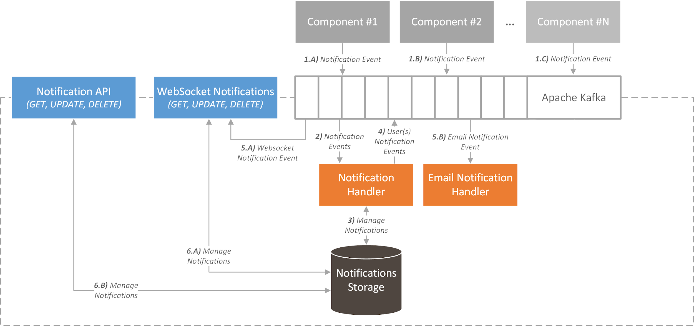

# ICARUS Notification Manager
## Overview
The main scope of the Notification Manager component is to notify the users via notifications and/or emails, based on their organization’s preferences, when several events are triggered. Those various events may be the addition or update of a data asset in the platform, activities related to asset brokerage between data consumers and data providers, or even the status update of a scheduled analytic job. 

## Architecture
In terms of design, the Notification Manager utilize a publish-subscribe pattern and is composed of the following subcomponents:
* The **Notification Message Queue**, which is a high-performance queuing service (Apache Kafka) that receives and manages the notification events that were published from several components.
* The **Notifications Storage** is responsible for storing historical notification data in the ICARUS Storage in order to show to the users all of their notifications.
* The **Notification Handler**, which is responsible for consuming the events that are stored inside the Notification Message Queue. It’s also responsible to store the notifications in the Notifications Storage.
* The **Email Notification Handler** has the same purpose as the Notification Handler, but instead of storing and pushing the notifications in the Message Queue, it sends directly emails to respective platform’s users.
* The **WebSocket Notifications**. This subcomponent was added in order to eliminate the constant opening of new connections between the Message Queue and the browser. With the use of WebSockets, a socket is kept open between the Message Queue and the browser so that the Message Queue can push notifications to the browser at any time without the need of opening new connections.
* The **Notification API** was included due to the need of interaction with various other services on the platform, such as the front-end. Through this Restful API the services are able to get each user’s notifications, set them seen, unseen, and delete them.

	

