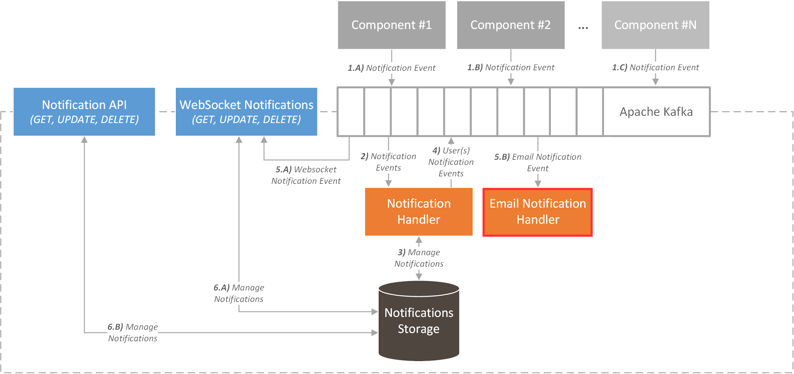

# ICARUS Notification Email Handler
## Overview
The ICARUS Notification Handler is a containerized service that is responsible to notify the users via email for any updates with regards to data assets (e.g. addition, updates, requests), or scheduled analytic jobs (e.g. status changes).

## Install
The whole service runs in the container, and the user needs first to compile the maven project and then run the appropriate docker commands.

### Maven build
```
mvn clean install package -Denvironment=prod
```

### Docker build
```
docker build -t notification_email_handler .
```

### Docker run
```
docker run -d --rm --name notification_email_handler notification_email_handler
```

### Docker stop
```
docker stop notification_email_handler
```

## Architecture
The Notification Email Handler works as a kafka consumer that consumes the notifications from a specific topic and sends them through an external email server. 
<div align="center">
	
</div>