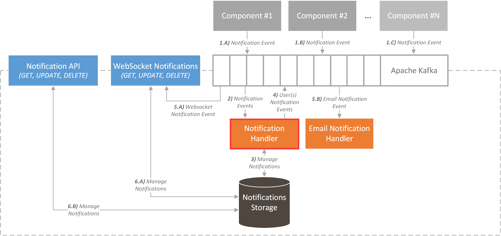

# ICARUS Notification Handler
## Overview
The ICARUS Notification Handler is a containerized service that is responsible to notify the users for any updates with regards to data assets (e.g. addition, updates, requests), or scheduled analytic jobs (e.g. status changes).

## Install
The whole service runs in the container, and the user needs first to compile the maven project and then run the appropriate docker commands.

### Maven build
```
mvn clean install package -Denvironment=prod -DskipTests
```

### Docker build
```
docker build -t notification_manager_consumer .
```

### Docker run
```
docker run -d -p 8085:8085 --rm --name notification_manager_consumer notification_manager_consumer
```

### Docker stop
```
docker stop notification_manager_consumer
```

## Architecture
The Notification Handler works as a kafka consumer module that connects also with a postgres database. It consumes the notifications that were published on a specific topic, checks through an api whether the user wants to receive a notification or/and email and then it stores the notification into the database. In the case where the user should receive an email it will re-publish the notification on a different topic where the Email Notification Module will receive the notification. 
<div align="center">
	
</div>