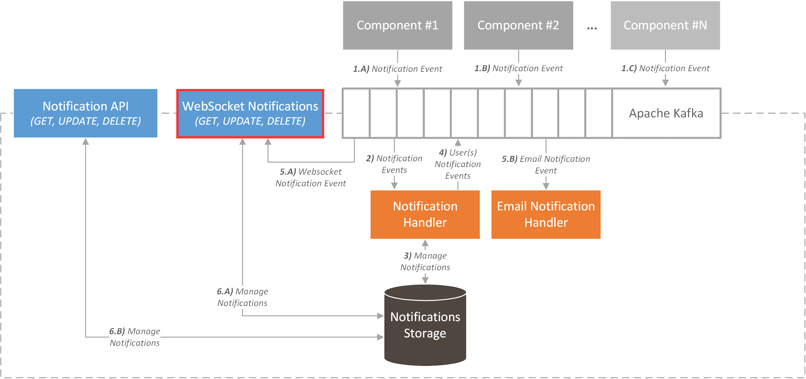

# ICARUS Notification Websocket Module
## Overview
The ICARUS Notification Websocket Module is a containerized service that is responsible to store the login-logout connections on the platform, and to push notifications on the platform in real time. The module uses the library socket.io in order to eliminate the constant opening-closing of new sockets.

## Install
The whole service runs in the container, and the user only has to run the appropriate docker commands.

### Docker build
```
docker build -t notification_websocket_server .
```

### Docker run
```
docker run -d --rm --name notification_websocket_server notification_websocket_server
```

### Docker stop
```
docker stop notification_websocket_server
```

## Architecture
The Notification Websocket Module also consumes events from a specific topic and provides the relevant information when someone makes a REST request to it. 
<div align="center">
	
</div>